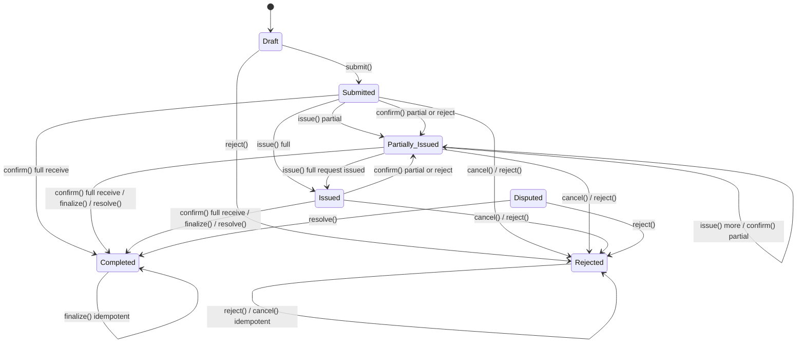
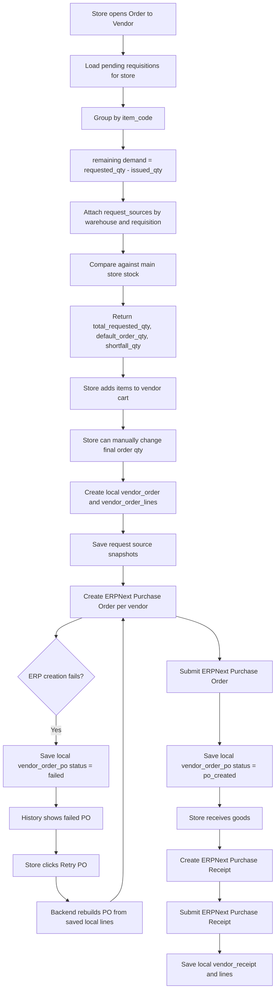

# Kitchen -> Store -> ERPNext Flow

Updated from the current codebase on 2026-03-23.

This document focuses on the real end-to-end flow:
- how kitchen asks store for stock
- how store fulfills or partially fulfills it
- how store creates vendor orders for remaining demand
- where ERPNext documents are created, submitted, or cancelled
- how local statuses change at each step

## 1. Strict Requisition State Machine

State machine rules:
- `issue()` may only start from `Submitted` or `Partially Issued`.
- `confirm()` may only start from `Submitted`, `Issued`, or `Partially Issued`.
- `confirm()` auto-completes the requisition when every requested item has `received_qty >= requested_qty`.
- `finalize()` remains the explicit close path for partial or rejected receipts and is idempotent for already completed records.
- Status notifications fire only when the requisition status actually changes.

## 2. Vendor Order Flow

## 3. Requisition Status Changes

| Local requisition status | How it is reached | What it means |
|---|---|---|
| `Draft` | Kitchen creates requisition | Request is editable by kitchen |
| `Submitted` | Kitchen submits draft | Store should review and issue |
| `Partially Issued` | Store issues less than full request, or kitchen confirms receipt | Request is still in progress |
| `Issued` | Store issues all requested qty | Store side is done issuing |
| `Completed` | Kitchen fully confirms receipt, kitchen finalizes, or admin resolves | Request is closed locally |
| `Rejected` | Store/admin rejects, or kitchen cancels | Request is closed without fulfillment |
| `Disputed` | Enum exists only | Not currently wired to an endpoint |

Important actual behavior:
- `confirm()` moves the requisition to `Completed` when all requested quantities are received.
- `confirm()` keeps the requisition in `Partially Issued` for partial and rejected receipts.
- `finalize()` can still move partially received requisitions to `Completed`, and repeated calls are idempotent once already completed.

## 4. Item-Level Status Changes

| Item status | How it is reached |
|---|---|
| `Pending` | Item is created in draft |
| `Issued` | `issued_qty === requested_qty` or full receipt confirmed |
| `Partially Issued` | `0 < issued_qty < requested_qty` or partial receipt confirmed |
| `Rejected` | Store leaves issued qty at `0`, or kitchen confirms zero receipt |

## 5. Where ERPNext Documents Are Created

| Business step | ERPNext document | Created when | Submitted when |
|---|---|---|---|
| Kitchen draft with requested items | Material Request | On `createDraft()` via queue | Not yet submitted |
| Kitchen draft update | Material Request update | On `updateDraft()` | Not yet submitted |
| Kitchen submit | Material Request | If needed, created immediately on submit or already exists | `submit_material_request` is queued |
| Kitchen submit with actual closing mismatch | Stock Reconciliation | Queue processor creates draft | Submitted immediately in the same processor |
| Store issues requisition | Stock Entry | Created immediately as draft in `issue()` | Submitted later on kitchen finalize |
| Kitchen finalize with existing stock entry | Stock Entry | Already exists | `submit_stock_entry` is queued |
| Kitchen finalize without existing stock entry | Stock Entry | `create-stock-entry` queue creates draft | Not auto-submitted in the same path |
| Store creates direct transfer | Material Request | Created immediately in `createAndIssueFromStore()` | Submitted immediately in the same flow |
| Store creates direct transfer | Stock Entry | Created immediately as draft | Submitted later when kitchen finalizes |
| Store creates vendor order | Purchase Order | Created immediately per vendor | Submitted immediately after create |
| Store receives vendor goods | Purchase Receipt | Created immediately | Submitted immediately after create |

## 6. Exact Kitchen -> Store -> ERPNext Flow

### Step 1. Kitchen creates a draft requisition

Local effects:
- `requisitions.status = Draft`
- `requisition_items.requested_qty = order_qty`
- `requisition_items.issued_qty = 0`
- `requisition_items.received_qty = 0`
- `requisition_items.item_status = Pending`

ERPNext effects:
- If the draft contains at least one item with `requested_qty > 0`, a Material Request draft is queued in ERPNext.
- The local record is updated with `erp_name` once the queue succeeds.

### Step 2. Kitchen submits the requisition

Local effects:
- `Draft -> Submitted`
- `submitted_at` is set
- store notification is emitted

ERPNext effects:
- Material Request is submitted in ERPNext.
- If the Material Request draft does not exist yet, submit first creates it and then queues submit.
- If any item has `actual_closing != closing_stock`, a Stock Reconciliation is created and immediately submitted in ERPNext.

### Step 3. Store reviews and issues stock

Local effects:
- each item gets more `issued_qty`
- requisition becomes:
  - `Issued` if all items are fully issued
  - `Partially Issued` if anything is under-issued
- `issued_at` is set
- optional `store_note` is saved

ERPNext effects:
- A Stock Entry draft is created immediately for the issued quantity.
- If the Material Request and its child rows are available, Stock Entry rows are linked back to:
  - `material_request`
  - `material_request_item`

### Step 4. Kitchen confirms what was actually received

Local effects:
- item `received_qty` is updated from accept / partial / reject action
- requisition status becomes:
  - `Completed` if all requested quantities are now fully received
  - `Partially Issued` otherwise

ERPNext effects:
- If the requisition auto-completes and a Stock Entry draft already exists, `confirm()` queues ERP submission of that draft.
- If the requisition auto-completes and no Stock Entry draft exists yet, `confirm()` queues the existing fallback Stock Entry draft-creation path.
- Partial and rejected confirmations do not create a new ERP document in `confirm()`

### Step 5. Kitchen finalizes

Local effects:
- requisition becomes `Completed`
- `completed_at` is set

ERPNext effects:
- If a draft Stock Entry already exists, finalize queues ERP submission of that draft.
- If no Stock Entry draft exists yet, finalize queues draft creation from `received_qty` or fallback `issued_qty`.
- If the requisition is already `Completed`, `finalize()` is a no-op and does not duplicate ERP submission.

Important nuance:
- In the fallback path, the queue creates a Stock Entry draft and stores `stock_entry`, but that path does not auto-submit the new draft inside `finalize()`.

## 7. Store-Initiated Transfer Flow

This is the special path where store sends material to a kitchen without waiting for a kitchen-created requisition.

API:
- `POST /store/transfer/create`

Local effects:
- a requisition is created directly with status `Issued`
- items are saved with:
  - `requested_qty = qty`
  - `issued_qty = qty`
  - `received_qty = 0`
  - `item_status = Issued`

ERPNext effects:
- Material Request is created and submitted immediately
- Material Request item row names are fetched and stored locally
- Stock Entry draft is created immediately and linked to the Material Request

What happens later:
- Kitchen can still confirm and finalize the transfer
- Finalize submits the existing Stock Entry draft

## 8. How Vendor Demand Is Calculated

Vendor demand is not based on shortfall first. It is based on warehouse requests first.

Source:
- `GET /store/vendor-order/shortage`

Calculation:
- start from store-visible requisitions
- per item, compute `remaining_qty = requested_qty - issued_qty`
- group all warehouses by `item_code`
- keep `request_sources[]` with:
  - `requisition_id`
  - `warehouse`
  - `requested_date`
  - `remaining_qty`
- compare grouped request total against main store stock

Returned fields:
- `total_requested_qty`
- `default_order_qty`
- `stock_qty`
- `shortfall_qty`
- `request_sources[]`

Important current behavior:
- default vendor order qty is seeded from `total_requested_qty`
- store user can manually change the final PO qty before ERP PO creation
- `shortfall_qty` is still shown for reference

## 9. Vendor Order Status Model

There are two separate local status layers.

### `vendor_orders.status`

| Status | Meaning |
|---|---|
| `draft` | Local vendor order header just created |
| `submitted` | ERP creation loop finished for all vendors |

### `vendor_order_pos.status`

| Status | Meaning |
|---|---|
| `po_created` | ERPNext Purchase Order was created and submitted |
| `failed` | ERPNext PO creation failed for that vendor |

Important current behavior:
- success or failure is tracked per vendor in `vendor_order_pos`
- history is ERP-first for successful records and DB-fallback for failed records
- retry updates the same failed `vendor_order_pos` row to `po_created` if retry succeeds

## 10. Retry PO Flow

API:
- `POST /store/vendor-order/retry/:id`

What happens:
1. Load the failed `vendor_order_pos` row.
2. Reject retry if status is not `failed`.
3. Load the original `vendor_order_lines` for that vendor.
4. Recreate the ERPNext Purchase Order from saved local qty and rate.
5. Submit the ERPNext Purchase Order.
6. Update the same local `vendor_order_pos` row:
   - `po_id = new ERP PO id`
   - `status = po_created`
   - `error_message = null`

If retry fails again:
- local status stays `failed`
- `error_message` is replaced with the latest ERP error

## 11. Purchase Receipt Flow

API:
- `GET /store/purchase-receipts/open-pos`
- `POST /store/purchase-receipts/create`
- `POST /store/purchase-receipts/:receiptId/upload`

Flow:
1. Store selects an ERP Purchase Order or creates a direct receipt.
2. Backend creates a Purchase Receipt draft in ERPNext.
3. Backend immediately submits the Purchase Receipt.
4. Local `vendor_receipt` and `vendor_receipt_lines` are saved.
5. Optional receipt photos are uploaded to ERPNext and attached to the Purchase Receipt.

## 12. Endpoint Map For This Flow

### Kitchen requisition lifecycle
- `POST /requisition`
- `PUT /requisition/:id`
- `PUT /requisition/:id/delete`
- `PUT /requisition/:id/submit`
- `PUT /requisition/:id/confirm`
- `PUT /requisition/:id/finalize`
- `PUT /requisition/:id/cancel`

### Store fulfillment lifecycle
- `GET /store/requisitions`
- `GET /store/requisitions/:id`
- `POST /store/requisition/:id/issue`
- `POST /store/transfer/create`
- `GET /store/transfer/sent`

### Store vendor ordering lifecycle
- `GET /store/vendor-order/shortage`
- `GET /store/vendor-order/items`
- `POST /store/vendor-order/create`
- `GET /store/vendor-order/history`
- `POST /store/vendor-order/retry/:id`
- `DELETE /store/vendor-order/po/:id`

### Store purchase receipt lifecycle
- `GET /store/purchase-receipts/open-pos`
- `POST /store/purchase-receipts/create`
- `POST /store/purchase-receipts/:receiptId/upload`

## 13. Key Corrections To Remember

- Material Request draft creation starts at kitchen draft creation, not only at submit time.
- Vendor demand groups pending warehouse requests by item and uses `requested_qty - issued_qty`.
- Store can order full requested quantity even if current stock makes shortfall smaller.
- `confirm()` auto-completes when `received_qty` reaches `requested_qty` for every requested item.
- `confirm()` keeps the requisition in `Partially Issued` for partial and rejected receipts.
- `finalize()` remains the explicit close step for partial or rejected receipts.
- Purchase Orders and Purchase Receipts are created as drafts and immediately submitted.
- Stock Reconciliation is created and immediately submitted.
- Stock Entry is created as draft first; submission happens later, usually on kitchen finalize.
- Store-initiated transfer creates a requisition already in `Issued` status and immediately creates/submits the ERP Material Request.
